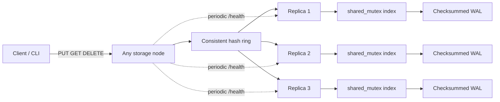

# Distributed Key-Value Store

[](https://github.com/poolanithinreddy/distributed-key-value-store/actions/workflows/ci.yml?query=branch%3Amain)

A real C++17, coordinatorless key-value service built to make distributed-database tradeoffs visible and testable. Any node can coordinate a request; deterministic consistent hashing selects replicas; configurable `N/R/W` quorums tolerate partial failures; checksummed write-ahead logs survive restarts; and periodic probes track peer health.

This is quorum replication, **not consensus**. It does not implement Raft, Paxos, linearizability, transactions, or dynamic membership.

## Capabilities

- Deterministic FNV-1a plus avalanche hashing, 128 virtual nodes by default, stable replica placement
- `N=3`, `R=2`, `W=2` defaults with concurrent bounded-time replica calls
- Lamport-style `(counter, origin)` versions, deterministic last-write-wins resolution, tombstones, read repair
- Thread-safe in-memory index and append-only checksummed binary WAL with safe trailing-corruption recovery
- Bounded request and replica worker pools, clean shutdown, request and connect/read/write timeouts
- Healthy/suspect/unavailable state transitions and automatic peer recovery detection
- Native HTTP/1.1 API, CLI, Prometheus metrics, structured JSON logs, and workload generator
- GoogleTest unit, three-process integration, concurrency, restart, and injectable-failure coverage

## Architecture



For a write, the coordinator first performs a quorum read to observe the latest Lamport counter, creates a higher version, and sends the record concurrently to all selected replicas. It succeeds after at least `W` acknowledgements. A read collects at least `R` responses, selects the greatest `(counter, origin)` version, and repairs stale respondents asynchronously. DELETE writes a versioned tombstone through the same path.

With `R + W > N`, successful reads and writes have an overlapping replica, but the service is not linearizable: concurrent coordinators may create conflicts, resolved deterministically by version and origin. A failed operation may have updated fewer than `W` replicas. See [consistency model](docs/consistency-model.md).

## Build and test

Requirements: CMake 3.16+, a C++17 compiler, Git (CMake fetches pinned GoogleTest v1.15.2), and POSIX sockets.

```bash
./scripts/build.sh
ctest --test-dir build --output-on-failure
```

Sanitizers:

```bash
cmake -S . -B build-asan -DKV_ENABLE_ASAN=ON -DCMAKE_BUILD_TYPE=Debug
cmake --build build-asan --parallel
ctest --test-dir build-asan --output-on-failure

cmake -S . -B build-tsan -DKV_ENABLE_TSAN=ON -DCMAKE_BUILD_TYPE=Debug
cmake --build build-tsan --parallel
ctest --test-dir build-tsan --output-on-failure
```

## Local three-node quick start

```bash
./scripts/build.sh
./scripts/run_cluster.sh
./scripts/smoke_test.sh
./scripts/stop_cluster.sh
```

Data is stored under `data/node{1,2,3}` and logs/PIDs under `cluster-logs/`; both are ignored by Git.

Docker Compose uses container-aware peer names and persistent volumes:

```bash
docker compose up --build -d
curl --fail http://127.0.0.1:8081/ready
docker compose down
```

## API and CLI

```bash
curl -X PUT http://127.0.0.1:8081/v1/kv/order-42 \
  -H 'Content-Type: application/json' -d '{"value":"created"}'
curl http://127.0.0.1:8082/v1/kv/order-42
curl -X DELETE http://127.0.0.1:8083/v1/kv/order-42

./build/kv_cli 127.0.0.1 8081 put order-42 created
./build/kv_cli 127.0.0.1 8082 get order-42
./build/kv_cli 127.0.0.1 8083 delete order-42
```

Operational endpoints are `GET /health`, `/ready`, `/metrics`, `/v1/cluster`, and `/v1/stats`. Full status codes and schemas are in [API documentation](docs/api.md).

## Benchmarks

The benchmark has warm-up and measured phases, deterministic per-client random streams, selectable PUT/GET/80:20 mixed workloads, keyspace, value size, and concurrency, and reports success/errors plus p50/p95/p99/max latency.

```bash
./scripts/run_cluster.sh
./build/kv_benchmark 127.0.0.1 8081 mixed 64 2 10 1000 128 benchmarks/results/mixed.json
# Full 3-size × 3-workload × 5-concurrency × 3-trial matrix:
./scripts/benchmark.sh
```

Latest locally verified measurements include 8,973 mixed ops/s at 7.414 ms p95 with 64 clients and 128-byte values on a local three-node Apple M4 cluster (median of three short trials). Full tables, errors, larger values, the one-node baseline, and limitations are in [benchmark results](benchmarks/README.md). Results are measurements, not targets; the historical résumé figures are evaluated in [resume claims](docs/resume-claims.md).

## Repository map

- `include/kv`, `src`: storage, ring, networking, replication, health, metrics, lifecycle
- `apps`: node daemon, CLI, and benchmark client
- `tests/unit`, `tests/integration`, `tests/failure`: deterministic tests and fault injection
- `config`: local and Docker three-node membership
- `scripts`, `docker-compose.yml`: repeatable build, cluster, smoke, failure, benchmark flows
- `docs`, `benchmarks`: guarantees, design, evidence, and limitations

## Tradeoffs and limitations

Membership is static and configuration-driven. Adding/removing nodes requires consistent configuration and manual data movement; there is no gossip or automatic rebalancing. Read repair is best effort, not hinted handoff or anti-entropy. Tombstones are retained indefinitely because safe garbage collection needs a cluster-wide horizon. WAL records are flushed, but this version does not call `fsync`, compact, snapshot, encrypt, authenticate, stream bodies, or implement TLS. The native HTTP layer intentionally supports the subset used by this service rather than all of RFC 9112.

The storage, replication, recovery, concurrency, and failure paths are implemented and tested. The static membership, LWW conflict model, in-process metrics, and single-machine deployment are educational simplifications, not a claim of internet-scale production readiness. See [limitations](docs/limitations.md) and [roadmap](docs/architecture.md#roadmap).

## Documentation

[Architecture](docs/architecture.md) · [Consistency](docs/consistency-model.md) · [Failure model](docs/failure-model.md) · [API](docs/api.md) · [Testing](docs/testing.md) · [Limitations](docs/limitations.md) · [Résumé evidence](docs/resume-claims.md)

## License

MIT © 2026 Nithin Reddy Poola.
